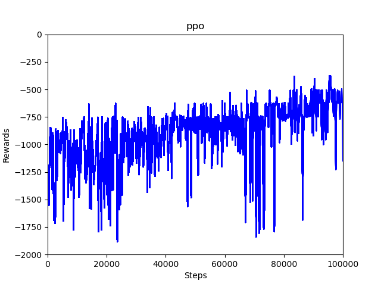

spinning-up-basic
=================

Basic versions of agents from [Spinning Up in Deep RL](https://spinningup.openai.com/) written in [PyTorch](https://pytorch.org/).

To see differences between algorithms, try running `diff -y <file1> <file2>`, e.g., `diff -y ddpg.py td3.py`.

Algorithms
----------

- [Vanilla Policy Gradient](https://spinningup.openai.com/en/latest/algorithms/vpg.html) (`vpg.py`)
- [Trust Region Policy Gradient](https://spinningup.openai.com/en/latest/algorithms/trpo.html) (`trpo.py`)
- [Proximal Policy Optimization](https://spinningup.openai.com/en/latest/algorithms/ppo.html) (`ppo.py`)
- [Deep Deterministic Policy Gradient](https://spinningup.openai.com/en/latest/algorithms/ddpg.html) (`ddpg.py`)
- [Twin Delayed DDPG](https://spinningup.openai.com/en/latest/algorithms/td3.html) (`td3.py`)
- [Soft Actor-Critic](https://spinningup.openai.com/en/latest/algorithms/sac.html) (`sac.py`)

Results
-------

VPG

TRPO

PPO

DDPG

TD3

SAC

Code Links
----------

- [Spinning Up in Deep RL](https://github.com/openai/spinningup) (TensorFlow)
- [Fired Up in Deep RL](https://github.com/kashif/firedup) (PyTorch)
