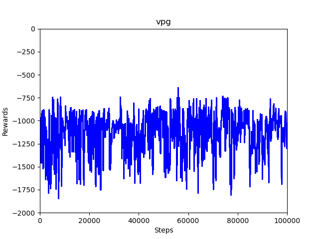
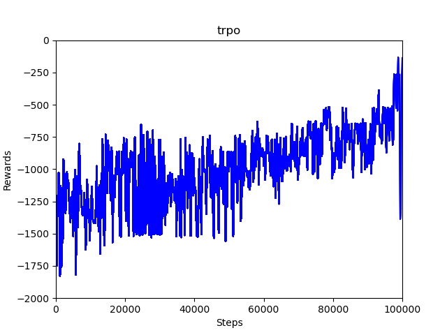

# spinning-up-basic

Basic versions of agents from [Spinning Up in Deep RL](https://spinningup.openai.com/) written in [PyTorch](https://pytorch.org/). Designed to run quickly on CPU on [`Pendulum-v0`](https://gym.openai.com/envs/Pendulum-v0/) from [OpenAI Gym](https://gym.openai.com/).

To see differences between algorithms, try running `diff -y <file1> <file2>`, e.g., `diff -y ddpg.py td3.py`.

For MPI versions of on-policy algorithms, see the [`mpi` branch](https://github.com/Kaixhin/spinning-up-basic/tree/mpi).

## Algorithms

- [Vanilla Policy Gradient](https://spinningup.openai.com/en/latest/algorithms/vpg.html)/Advantage Actor-Critic (`vpg.py`)
- [Trust Region Policy Gradient](https://spinningup.openai.com/en/latest/algorithms/trpo.html) (`trpo.py`)
- [Proximal Policy Optimization](https://spinningup.openai.com/en/latest/algorithms/ppo.html) (`ppo.py`)
- [Deep Deterministic Policy Gradient](https://spinningup.openai.com/en/latest/algorithms/ddpg.html) (`ddpg.py`)
- [Twin Delayed DDPG](https://spinningup.openai.com/en/latest/algorithms/td3.html) (`td3.py`)
- [Soft Actor-Critic](https://spinningup.openai.com/en/latest/algorithms/sac.html) (`sac.py`)
- Deep Q-Network (`dqn.py`)

## Implementation Details

Note that implementation details can have a significant effect on performance, as discussed in [What Matters In On-Policy Reinforcement Learning? A Large-Scale Empirical Study](https://arxiv.org/abs/2006.05990). This codebase attempts to be as simple as possible, but note that for instance on-policy algorithms use separate actor and critic networks, a state-independent policy standard deviation, per-minibatch advantage normalisation, and several critic updates per minibatch, while the deterministic off-policy algorithms use layer normalisation. Equally, soft actor-critic uses a transformed Normal distribution by default, but this can also help the on-policy algorithms.

## Results

### Vanilla Policy Gradient/Advantage Actor-Critic

### Trust Region Policy Gradient

### Proximal Policy Optimization

### Deep Deterministic Policy Gradient

### Twin Delayed DDPG

### Soft Actor-Critic

### Deep Q-Network

## Code Links

- [Spinning Up in Deep RL](https://github.com/openai/spinningup) (TensorFlow)
- [Fired Up in Deep RL](https://github.com/kashif/firedup) (PyTorch)
